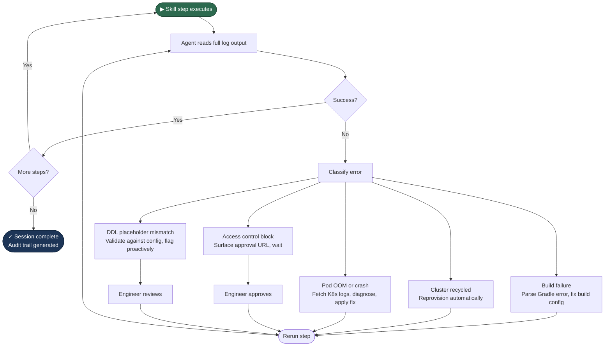

Creating a Flink pipeline at work used to take hours. Not because Flink is hard.
Because you had to navigate 6-8 steps across JupyterLab, terminal, wiki docs,
access control portals, and schema registry. In the right order.
Any wrong step meant oncall.

I automated it with an agent. Full workflow now completes in under 10 minutes.
Zero oncall escalations for this class of issue since.

Here's how it works and what made it actually hard to build.

## The Problem

Engineers relied on a wiki doc to get through each pipeline creation step.
Context-switching between the JupyterLab UI, terminal, access control portals,
and metadata catalogs. Build failures, stale clusters, and access control
misconfigurations routinely required escalation. Median time to a working
pipeline: hours.

The manual steps weren't the real problem. The failure handling was.
Every step had a different failure mode. None of them had a standard fix.
That's what made this interesting to build.

## How It's Built

A Claude Code plugin with 11 composable skills. Built in Python on top of
Jupyter kernel internals and IPython magic commands so it runs natively
inside the same environment engineers already work in. No new tooling, no
platform changes.

Each skill is backed by a purpose-built CLI that talks directly to platform
APIs: Flink SQL gateway, access control services, schema registry, kernel
sessions. The skills are independent you can run the full workflow or just
one step.

But the CLI layer is the easy part.

## The Failure Recovery Layer

This is what separates it from a CLI wrapper.

After every skill step, a reasoning layer reads the full log output and decides
what to do. Not just "did it succeed?" it reads the actual error and takes
corrective action.

**Build failure:** Parses the Gradle error, identifies the root cause, fixes
the build config, reruns. Engineers don't see the failure unless the fix itself
fails.

**Cluster recycled mid-session:** Platform recycles idle clusters. The agent
detects the error, reprovisions automatically, and resumes where it left off.
Previously this required manual intervention every time.

**Job pod OOM crash:** Fetches Kubernetes pod logs, diagnoses whether it's an
OOM or a misconfiguration, applies or suggests the fix depending on confidence.

**Access control pending:** Identifies the pending request, surfaces the exact
approval URL, advises retry after approval. No more digging through portals to
find the right link.

**DDL placeholder mismatch:** Validates substitution against app config before
execution and flags mismatches proactively. Catches a whole class of silent
failures before they happen.

None of these hit oncall anymore.

## Human-in-the-Loop and Audit Trail

Two things I spent more time on than I expected.

Before every command, the agent surfaces the exact parameters and a 1-2 line
review before anything runs. This wasn't optional it's what made people
actually trust it.

There's also a summary command. Run it at any point to get a structured view
of what has completed and what remains. Useful mid-session, and essential
when something goes wrong and you want to understand the state.

I also built a session summary skill that reconstructs the entire session from
conversation logs every operation, every failure, every fix, in order.
Structured audit trail. Turned out to be one of the more-used features.

"Every agent action should be explainable, attributable, auditable." That's
not a principle for this system. It's a feature.

## Impact

- Full workflow in under 10 minutes. Was hours.
- Zero oncall escalations for this class of issue since shipping.
- Everything in one terminal. No context switching between UI, wiki, portals,
  and catalogs.
- Each skill runs independently. Add a single source without rerunning the
  whole workflow.
- No platform changes required. Integrates at the CLI layer only.

## What I'd Build Differently

The recovery layer grew organically as I hit each failure mode in production.
I'd design it upfront next time define the failure taxonomy first, then build
the recovery handlers. The way it happened, each fix was slightly inconsistent
in how it reported back to the engineer.

I'd also add structured evals earlier. Right now I know it works because I
can see it working. That's not the same as having a repeatable way to verify
it still works after changes.

---

The gap between a demo and something engineers actually use is mostly a failure
handling problem. Happy path is easy. Recycled clusters, OOM crashes, stale
access tokens: that's where demos die.

If you're building something similar or have thoughts on the recovery layer
design, I'd be curious to hear it.